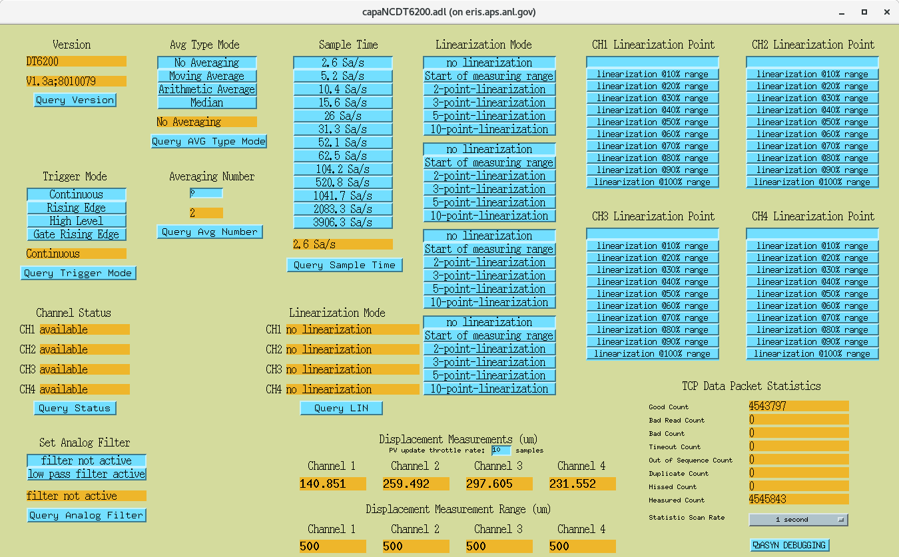

Using the microEpsilon instrument support
========================================

Several files need minor modifications to use microEpsilon instrument
support in an application.

1. Add the full path to the microEpsilon support directory to the
application configure/RELEASE file.
 microepsilon=*xxxx*/modules/instrument/microEpsilon/<release\>

 Where <release\> is the release number of of the microEpsilon support.

2. Add instrument support to application database definition file.

 The application database definition file must include the database
definition files for the Micro-Epsilon instrument, Asyn support, and
StreamDevice support. There are two ways that this can be done:

   -If you are building your application database definition file from
    an xxxInclude.dbd file you include the additional database
    definitions in that file:  
     include "base.dbd"  
     include "capaNCDT6200.dbd"  
     include "stream.dbd"  
     include "asyn.dbd"  
     include "drvAsynIPPort.dbd"  

   -If you are building your application database definition file from
    the application Makefile you specify the additional database
    definitions there:  
     xxx_DBD += base.dbd  
     xxx_DBD += capaNCDT6200.dbd  
     xxx_DBD += stream.dbd  
     xxx_DBD += asyn.dbd  
     xxx_DBD += drvAsynIPPort.dbd  

   You must link the microEpsilon support library, the Asyn support
    library, and StreamDevice support library with the application. Add
    the following lines:  
     xxx_LIBS += microEpsilon  
     xxx_LIBS += stream  
     xxx_LIBS += asyn  
     before the xxx_LIBS +=             $(EPICS_BASE_IOC_LIBS)     in the
    application Makefile.

3. Load the microEpsilon support database records in the application
startup script.

Installation and Building
=========================

After obtaining a copy of the distribution, it must be installed and
built for use at your site.

1.  Create an installation directory for the module. The path name of
    this directory should end with modules/instrument/microEpsilon.
2.  Place the distribution file into this directory.
3.  Execute the following commands:
     cd modules/instrument/microEpsilon  
     gunzip microEpsilon<release>.tar.gz  
     tar xvf microEpsilon<release>.tar  
     cd <release\>  
     Where <release\> is the release number of of the MicroEpsilon
    support.
4.  Edit the configure/RELEASE file and set the paths to your
    installation of EPICS base, Asyn, and StreamDevice.
5.  Execute make in the top level directory.

IOC st.cmd file additions
==========================

The following lines will need to be added to the IOC st.cmd file to
configure, connect and load the required databases.

1.  The following lines will setup the Asyn/StreamDevice port for the
    capaNCDT6200 unit.  
    \## Set up ASYN/STREAMDEVICE port for capaNCDT6200 unit  
    \##  
    \## drvAsynIPPortConfigure(port,ipInfo, priority, noAutoconnect, noProcessEos)  
    \##  
    drvAsynIPPortConfigure("L0","10.6.28.17:23",0,0,0)  
    asynSetTraceIOMask("L0",-1,0x2)  
    asynSetTraceMask("L0",-1,0x1)  

2.  The following lines will configure the custom ASYN support module
    for the capaNCDT6200 unit.  
    \## configure ASYN module for capaNCDT6200 unit  
    \##  
    \## capaNCDT6200Configure(Asyn port, ipAddr, ipPort)  
    \##  
    capaNCDT6200Configure("L1","10.6.28.17",10001)  
    asynSetTraceIOMask("L1",-1,0x2)  
    asynSetTraceMask("L1",-1,0x1)  

3.  The following lines will load the databases for the capaNCDT6200
    unit.  
    \## configure ASYN module for capaNCDT6200 unit  
    \##  
    \## capaNCDT6200Configure(Asyn port, ipAddr, ipPort)  
    \##  
    dbLoadRecords("db/xxCapaNCDT6200.vdb", "dev={PV Name Prefix},Link=L0")  
    dbLoadRecords("db/xxCapaMeas.vdb", "dev={PV Name Prefix},PORT=L1")  

PV's in Databases
==================
The following is a brief description of the PV's in the support module
database files. 

**Waveform** **Records**

Name | DTYP | FTVL | NELM | Description
-----|------|------|:----:|------------
$(dev):welcome | stream | CHAR | 100 | Reads the "welcome" text the unit sends.
$(dev):deviceID | stream | CHAR | 100 | Device ID of the unit.
$(dev):serialNum | stream | CHAR | 100 | Serial number of the unit.
$(dev):measDataM | stream | CHAR | 250 | Uses the grabWelcomeText command in the StreamDevice protocol file to parse the initial text the unit sends along with the measurement data. After parsing the text the individual channels of data are parsed by a FLNK to the $(dev):chanXInfoM (X = 1-4)  PV's.

 **Stringin** **Records**

Name | DTYP | Description
-----|------|------------
$(dev):version1M | soft channel | Part of the device Version information.
$(dev):version2M | soft channel | Part of the device Version information.
$(dev):chan1NAM $(dev):chan2NAM $(dev):chan3NAM $(dev):chan4NAM | soft channel | Channel name information.
$(dev):chan1UNT $(dev):chan2UNT $(dev):chan3UNT $(dev):chan4UNT | soft channel | Channel unit of measuring range.

 **Stringout** **Records**

Name | DTYP | Description
-----|------|------------
$(dev):chanStatusM | stream | Sends StreamDevice command to query the status of each channel.
$(dev):linModeM | stream | Sends StreamDevice command to query the linearization type for each channel.
$(dev):statusM | stream | Sends StreamDevice command to query the status of the unit.
$(dev):chan1InfoM $(dev):chan2InfoM $(dev):chan3InfoM $(dev):chan4InfoM | stream | Sends StreamDevice command to query the parameters of channel X (X = 1-4).

 **Longin** **Records**

Name | DTYP | ASYN Subaddress | Description
-----|------|:------------------:|------------
$(dev):avgNumModeM | longin | |The current number of measuring values used to calculate the average.
$(dev):dataPortM | longin | | The current ip port number of the data port.
$(dev):measDataMonitor | longin | | In trigger mode, measuring value in binary mode via data port.  Not currently used, unit is in "continous transmission" mode.
$(dev):chan1ANO $(dev):chan2ANO $(dev):chan3ANO $(dev):chan4ANO | longin | | Channel X (X = 1-4) Article number.
$(dev):chan1OFS $(dev):chan2OFS $(dev):chan3OFS $(dev):chan4OFS | longin | | Channel X (X = 1-4) Measuring range offset.
$(dev):chan1SNO $(dev):chan2SNO $(dev):chan3SNO $(dev):chan4SNO | longin | | Channel X (X = 1-4) Serial number.
$(dev):chan1RNG $(dev):chan2RNG $(dev):chan3RNG $(dev):chan4RNG | longin | | Channel X (X = 1-4) Measuring range.
$(dev):dataPacket:goodCount | asynInt32 | 20 | Shows the number of good TCP packets received.
$(dev):dataPacket:badReadCount | asynInt32 | 21 | Shows the number of bad packets read.
$(dev):dataPacket:badCount | asynInt32 | 22 | Shows the number of ASYN port read fails.
$(dev):dataPacket:timeoutCount | asynInt32 | 23 | Shows the number of ASYN timeouts.
$(dev):dataPacket:outSequenceCount | asynInt32 | 24 | Shows the number of TCP packets received out of sequence.
$(dev):dataPacket:duplicateCount | asynInt32 | 25 | Shows the number of duplicate TCP packets received.
$(dev):dataPacket:missedCount | asynInt32 | 26 | Shows the number of missed TCP packets.
$(dev):dataPacket:measuredCount | asynInt32 | 27 | Shows the number of measurements the capaNCDT6200 unit has transmitted over ethernet.

 **Longout** **Records**

Name | DTYP | ASYN Subaddress | Description
-----|------|:------------------:|------------
$(dev):avgNumModeC | stream | | Sets the number of measuring values used to calculate the average (adjustable from 2..8).
$(dev):ch1ClearMathFunC $(dev):ch2ClearMathFunC $(dev):ch3ClearMathFunC $(dev):ch4ClearMathFunC | stream | | Deletes the math function on channel X (X = 1-4).
$(dev):dataPortC | stream | | Sets the port number of the data port.  Range: 1024...65535.
$(dev):measRangeChan1C $(dev):measRangeChan2C $(dev):measRangeChan3C $(dev):measRangeChan4C | asynInt32 | 5 6 7 8 | Sets channel X (X = 1-4) measuring range in the unit using $(dev):chan{X}RNG.VAL as the DOL field.
$(dev):pvThrottleC | asynInt32 | 9 | Sets the PV update rate in the custom ASYN support module by averaging N values received from the unit.
$(dev):numMeasChans | asynInt32 | 40 | Sets the number of channels the custom ASYN support module should process in the TCP data.

 **Mbbi** **Records**

Name | DTYP | Description
-----|------|------------
$(dev):avgTypeModeM | stream | Shows the mode of measurement averaging. n = 0: No averaging (default) n = 1: Moving average n = 2: Arithmetic average (outputs only each nth measuring value)  n = 3: Median
$(dev):trigModeM | stream | Shows the trigger mode.  n = 0: Continuous transmission (default).  This is the ONLY mode this support module has been developed to work with.  n = 1: Triggermode 1 (rising edge)   n = 2: Triggermode 2 (high level)  n = 3: Triggermode 3 (gate rising edge) 
$(dev):chan1StatM $(dev):chan2StatM $(dev):chan3StatM $(dev):chan4StatM | | Shows channel X (X = 1-4) status.  n = 0: not available  n = 1: available  n = 2: math function
$(dev):chan1LinModeM $(dev):chan2LinModeM $(dev):chan3LinModeM $(dev):chan4LinModeM | | Shows channel X (X = 1-4) linearization mode.  n = 0: no linearization (default)  n = 1: Start of measuring range  n = 2: 2-point-linearization  n = 3: 3-point-linearization  n = 4: 5-point-linearization  n = 5: 10-point-linearization
$(dev):sampleTimeM | stream | Shows the requested sample time.  n = 384000: 2.6 Sa/s  n = 192000: 5.2 Sa/s  n = 96000: 10.4 Sa/s  n = 64000: 15.6 Sa/s  n = 38400: 26 Sa/s  n = 32000: 31.3 Sa/s  n = 19200: 52.1 Sa/s  n = 16000: 62.5 Sa/s  n = 9600: 104.2 Sa/s  n = 1920: 520.8 Sa/s  n = 960: 1041.7 Sa/s  n = 480: 2083.3 Sa/s  n = 256: 3906.3 Sa/s   NOTE: Depending on how fast you set the sampling time, the soft IOC may not be able to keep up with the amount of data being sent over the TCP port.  This can be seen by an increasing "Missed count" under the TCP Data Packet Statistics.
$(dev):analogFilterM | stream | Shows the status of the low pass filter with 20 Hz limit frequency on analog output.  n = 0: Low pass filter not active  n = 1: Low pass filter is active

 **Mbbo** **Records**

Name | DTYP | Description
-----|------|------------
$(dev):avgTypeModeC | stream | Sets the mode of measurement averaging.  n = 0: No averaging (default)  n = 1: Moving average  n = 2: Arithmetic average (outputs only each nth measuring value)  n = 3: Median
$(dev):trigModeC | stream | Sets the trigger mode.  n = 0: Continuous transmission(default).  This is the ONLY mode this support module has been developed to work with.  n = 1: Triggermode 1 (rising edge)  n = 2: Triggermode 2 (high level)  n = 3: Triggermode 3 (gate rising edge)
$(dev):sampleTimeC | stream | Sets the requested sample time.  n = 384000: 2.6 Sa/s  n = 192000: 5.2 Sa/s  n = 64000: 15.6 Sa/s  n = 38400: 26 Sa/s  n = 32000: 31.3 Sa/s  n = 19200: 52.1 Sa/s  n = 16000: 62.5 Sa/s  n = 9600: 104.2 Sa/s  n = 1920: 520.8 Sa/s  n = 960: 1041.7 Sa/s  n = 480: 2083.3 Sa/s  n = 256: 3906.3 Sa/s   NOTE: Depending on how fast you set the sampling time, the soft IOC may not be able to keep up with the amount of data being sent over the TCP port.  This can be seen by an increasing "Missed count" under the TCP Data Packet Statistics.
$(dev):chan1LinModeC $(dev):chan2LinModeC $(dev):chan3LinModeC $(dev):chan4LinModeC | stream | Sets channel X (X = 1-4) linearization mode.  n = 0: no linearization (default)  n = 1: Start of measuring range  n = 2: 2-point-linearization  n = 3: 3-point-linearization  n = 4: 5-point-linearization  n = 5: 10-point-linearization
$(dev):CH1:setLinPointC $(dev):CH2:setLinPointC $(dev):CH3:setLinPointC  $(dev):CH4:setLinPointC | stream | Sets channel X (X = 1-4) linearization point.  n = 1: linearization point at 10% of the measuring range  n = 2: linearization point at 20% of the measuring range  n = 3: linearization point at 30% of the measuring range  n = 4: linearization point at 40% of the measuring range  n = 5: linearization point at 50% of the measuring range  n = 6: linearization point at 60% of the measuring range  n = 7: linearization point at 70% of the measuring range  n = 8: linearization point at 80% of the measuring range  n = 9: linearization point at 90% of the measuring range  n = 10: linearization point at 100% of the measuring range   NOTE: Feature not currently used.  The corresponding query for this setting has not been implented in the support module.
$(dev):analogFilterC | stream | Sets the low pass filter with 20 Hz limit frequency on analog output.  n = 0: Low pass filter not active  n = 1: Low pass filter is active

 **Analog Input** **Records**

Name | DTYP | ASYN  Subaddress | Description
-----|------|:-------------------:|------------
$(dev):dispChan1M $(dev):dispChan2M $(dev):dispChan3M $(dev):dispChan4M | asynFloat64 | 1  2  3  4 |Shows the current displacement value for channel X (X = 1-4).\

  **Fanout** **Records**

Name | Description
-----|------------
$(dev):dataPacket:Fanout | Controls the rate at which the dataPacket statistics are updated.
$(dev):dataPacket:Fanout2 | Additional dataPacket PV's to update.  Rate controlled by SCAN field of $(dev):dataPacket:Fanout

Caution
=======
If the MicroEpsilon capaNCDT6200 unit is power cycled, communications with the IOC may not resume automatically.  There is an issue with the capaNCDT6200 unit that prevents ASYN from successfully reconnecting with the unit every time.  The IOC may need to be restarted to restore proper communications with the capaNCDT6200 unit.

Operator Display
=================
Below is a screen capture of an example MEDM display file included with the MicroEpsilon device support module for a capaNCDT6200 unit.

This operator display defaults to a single displacement channel for a capaNCDT6200 unit and the other three channel displacements will not be visible until the "Channel Status" PV is processed and the capaNCDT6200 unit's channel status is retrieved for each channel thus setting the appropriate visibility for each additional channel.
